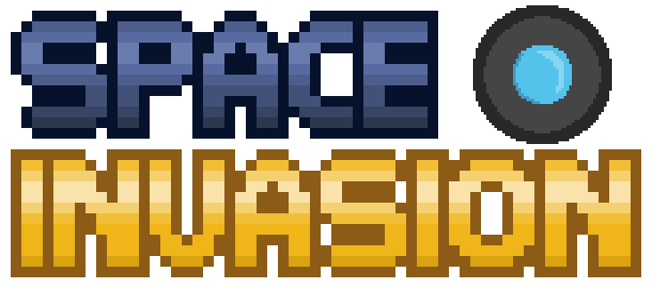

# 🚀 Space Invasion

## 1. Identificação do Projeto

### 🎮 Título do Projeto
**Space Invasion**

### 👨‍💻 Desenvolvedor
**Nome:** Rafael Queiroz Logrado



---

## 2. Visão Geral do Sistema

### 📖 Descrição
O **Space Invasion** é um game arcade onde jogadores controlam naves espaciais com o objetivo de defender o planeta Terra contra invasões alienígenas.

### 🎯 Objetivo
Defender o planeta Terra destruindo naves inimigas antes que elas avancem, acumulando pontos e sobrevivendo o máximo possível.

### 🌌 Tema
O jogo possui temática espacial, onde dois jogadores cooperam para enfrentar ondas de inimigos alienígenas. O foco está na ação rápida, cooperação e melhoria contínua através de power-ups.

### 🎮 Instruções de Jogabilidade

#### 👤 Player 1 (P1)
- **W, A, S, D** → Movimentação  
- **H** → Atirar  

#### 👤 Player 2 (P2)
- **Setas direcionais** → Movimentação  
- **L** → Atirar  

### ⚡ Power-ups
- ➕ **Vida** → Recupera vida (ou dá pontos se estiver no máximo)  
- 🔫 **Poder de tiro** → Aumenta o dano  
- ⚡ **Cadência de tiro** → Aumenta a velocidade dos disparos  

### 🧠 Especificações Técnicas

O jogo possui progressão baseada em sobrevivência, onde a dificuldade aumenta conforme o tempo passa, com o surgimento mais frequente de inimigos.

Os jogadores compartilham uma quantidade limitada de vidas. Ao serem atingidos ou ao deixar inimigos passarem, a vida é reduzida. O jogo termina quando a vida chega a zero.

A pontuação é acumulada ao derrotar inimigos e pode ser reduzida caso eles escapem. O objetivo é alcançar a maior pontuação possível antes da derrota.

Durante a partida, inimigos podem dropar **power-ups**, que concedem melhorias como aumento de vida, dano ou velocidade de disparo. Esses bônus ajudam os jogadores a resistirem por mais tempo.

## Requisitos e regras de negócio

### 1. Requisitos funcionais
#### RF01 - Interface de menu: O jogo começa na tela de menu, dando ao usuário três opções: "Jogar", "Manual", e "Sobre".
#### RF02 - Movimentação: No jogo, o player deve conseguir se movimentar tanto na vertical, quanto na horizontal.
#### RF03 - Sistema de tiro: O player pode atirar contra os inimigos.
#### RF04 - Sistema de power-ups: O player pode coletar power-ups que são deixados por inimigos.

### 2. Requisitos não funcionais
#### RNF01 - Desempenho: O jogo deve rodar a 60 FPS (quadros por segundo).
#### RNF02 - Escalabilidade: O jogo deve suportar até 10 computadores rodando ele ao mesmo tempo.
#### RNF03 - Portabilidade: O jogo deve ser suportado em telas com a resolução de 1920x1080, em ambiente Windows 11.

### 3. Regras de negócio
#### RN01 - Sistema de pontos: O jogador deve receber pontos ao derrotar inimigos e coletar certos power-ups, e perder pontos ao deixar inimigos passarem ou tomar dano.
#### RN02 - Sistema de vidas: O jogador possui 3 vidas, podendo perder ou receber vidas. 
#### RN03 - Fases: O jogo tem 3 fases no total, com cada uma tendo uma imagem de fundo diferente.
#### RN04 - Sistema de tiro: O jogador pode atirar balas nos inimigos. Cada tipo de inimigo precisa de uma quantidade diferente de danos para ser abatido
#### RN05 - Sistema de power-ups: Os inimigos podem deixar três tipos de "power-ups" diferentes. Esses podem melhorar a cadência e poder de tiro, ou dar uma vida extra/pontos.

## 📁 Estrutura do Projeto

Abaixo está a **estrutura do projeto**, organizada para facilitar a manutenção, escalabilidade e entendimento do código:

```bash
.
│   index.html          # Página principal
│   index.js            # Lógica principal do jogo
│   menu.js             # Controle do menu
│   style.css           # Estilização
│
│   diagramas_UML.asta  # Arquivo do Astah (diagramas UML)
│   diagrama_casouso.png
│   diagrama_classes.png
│   diagrama_sequencia.png
│
│   README.md
│
├── img                 # Recursos visuais do jogo
│   ├── background      # Fundos animados
│   │   ├── background1
│   │   ├── background2
│   │   └── background3
│   │
│   ├── botao           # Botões da interface
│   ├── efeitos         # Efeitos visuais (ex: impacto do tiro)
│   ├── inimigos        # Sprites dos inimigos
│   ├── player          # Sprites do jogador
│   ├── powerup         # Itens especiais
│   └── texto           # Telas e mensagens
│
├── models              # Modelos/classes do jogo
│   └── Nave.js
│
└── sfx                 # Efeitos sonoros
    ├── foguete.mp3
    ├── laser.mp3
    └── powerup.mp3
```

### 👥 Créditos

#### 👨‍💻 Desenvolvedor
- Nome: Rafael  
- GitHub: [RafaelLogrado](https://github.com/RafaelLogrado)  
- Contato: rafael_logrado@estudante.sesisenai.org.br  

#### 📌 Product Owner
- Nome: Carlos  

---

### 🌐 Link de Produção
👉 https://space-invasion-raf.vercel.app/

---

## 3. Instruções de Instalação e Execução

### 📥 1. Clonagem
git clone https://github.com/RafaelLogrado/nave_2026

### ▶️ 2. Execução do Projeto

Abra o arquivo `index.html` diretamente no navegador:

- Clique duas vezes no arquivo **index.html**
ou
- Clique com o botão direito → **Abrir com navegador**

### 🌍 3. Versão em Produção
👉 https://space-invasion-raf.vercel.app/